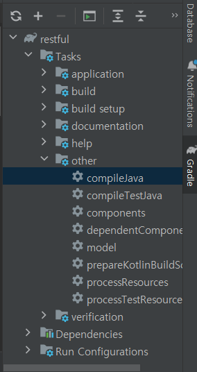
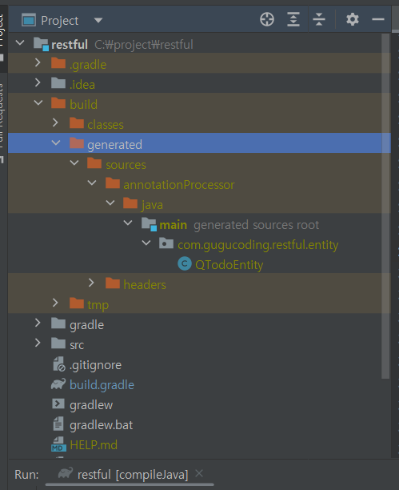

# restAPI
RESTful API 서버 구현 - 구멍가게 코딩단 

# Chapter 
- @RequiredArgsConstructor , final : 의존성 주입
- TDD에서 @Log4j2
  - testCompileOnly 'org.projectlombok:lombok:1.18.24' 
  - testAnnotationProcessor'org.projectlombok:lombok:1.18.24'
- 데이터 베이스 : 스프링부트 컨넥션 풀은 HikariCP
  - implementation 'org.springframework.boot:spring-boot-starter-data-jpa'
  - implementation 'org.springframework.boot:spring-boot-starter-data-jdbc'
  - runtimeOnly 'com.mysql:mysql-connector-j'
- 레파지토리
  - extends JpaRepository<TodoEntity, Long>

# 영속성 컨텍스트 , 더킹 체크
- 하나의 트랜젠션
  - Entity를 변화하면 자동으로 save를 쓰지 않아도 update가 적용됨. 이를 더킹 체크라함.
  - findById()를 하게 되면 , 현재 담고 있는게 있는지 판단하고 조회를 한다 
    - 같은걸 두번 조회를 하면 한번만 조회 됨.(영속성 컨텍스트 안에서 확인함.)

# 쿼리 관련
- 쿼리 메소드
- JPQL : @Qurey 를 이용한 쿼리
  - value , countQuery, nativeQuery 속성을 지정 할수 있다 .
  - :를 이용해서 param을 사용 예) like %:param% and ~ / @Param("param)
  
- Spring data JPA , QureyDsl 
  - QueryDsl
  - 
  - 적용 후 Q클래스가 생성.
  - 

# QueryDsl
- 인터페이스 , Impl : extend QuerydslRepositorySupport 
  - Q[Todo]Entity 사용 : Qclass에 사용된 @Entity에 대한 new QTodoEntity("") 가 정의 되어 있음.
  - JPQLQuery : 

# JPA Paging
- Page<T> 페이지 정보를 담게 되는 인터페이스
- Pageable 페이지 처리에 필요한 정보를 담게되는 인터페이스 
  - Pagable이 JpaRepository가 상속된 인터페이스의 메소드에 파라미터로 전달.이때 Page<T>가 return 된다.

- PageRequest 
  - of(int page, int size) 0 부터 시작하는 페이지 번호와 개수 , 정렬이 지정되지 않는다. 
  - of(int page, int size, Sort sort) 페이지 번호와 개수 , 정렬 
  - PageRequest에 의해 Pageable이 객체화 된다. (Pageable === PageRequest.of())

- 페이징
  - return PageableExecutionUtils.getPage(dtoList, pageable, dtoQuery::fetchCount);
  - return new PageImpl<>(dtoList,pageable,count);

# Validate 관련
- 1) BindingResult 이용 , 
- 2) @RequestControllerAdvice AOP 이용
  - AOP : 반복적인 문제에 대한 코드를 advice를 만들어서 기존 코드와 결합
  - @ExceptionHandler 란 ? 

# Spring Security
- org.springframework.boot:spring-boot-starter-security
- CustomSecurityConfig (@Configuration) 설정 
- PasswordEncoder 
  - BCryptPasswordEncoder 적용

# @EntityListeners 
- 엔티티의 생명주기 이벤트를 처리하기 위해 사용하는 기능이다. 이 기능을 사용하면 엔티티가 생성되거나 업데이트될 때 특정 로직을 실행
- 어노테이션으로 @CreatedBy(작성자) , @CreatedDate(작성일) @LastModifiedDate(수정일) @LastModifiedBy(수정자)
을 자동으로 넣어 주는 기능을  제공한다 .

# Test관련
- @DataJpaTest : @SpringBootTest와 다르게 @Entity와 같은 데이터베이스 관련부분만 실행
- @AutoConfigureTestDatabase(replace = AutoConfigureTestDatabase.Replace.NONE)
  - Replace.NONE 설정이 없으면, 실제 데이터베이스를 이용할 수 없다.

